# Eco3DPrint
*Internet of Things, a.y. 2025/2026*

*Univeristy of Pisa,*
*Department of Information Engineering,*
*m.sc. Artificial Intelligence and Data Engineering*

*Project by Francesco Panattoni*

## Introduction
The advent of **3D Printing** has revolutionized manufacturing, prototyping, and personal fabrication by allowing digital models to be transformed into physical objects layer by layer. However, the additive **manufacturing process is inherently susceptible to physical anomalies**. A slight deviation in temperature, extrusion rate, or mechanical calibration can lead to catastrophic print failures. When a printer operates unmonitored for extended periods, these undetected failures result in a significant waste of filament materials, excessive energy consumption, and lost time.

To mitigate this inefficiency, we must look toward modern networking paradigms. The **Internet of Things** (IoT) represents the evolution of the network that extends connectivity to physical objects of daily life. By transforming standalone, "dumb" 3D printers into smart, interconnected assets, we can actively monitor their health and intervene dynamically before resources are wasted.

This report presents ***<u>Eco3DPrint</u>***, *an intelligent monitoring application designed to safeguard the 3D printing process*. An IoT system is composed of four functional levels: devices and sensors that collect data, connectivity that allows data to travel, data processing on the cloud, and a user interface. The architecture is inspired to the "*Comprehensive Review on Internet of Things Applications in Power Systems*" [1](#ref1).

Our solution fully embodies this architecture. We deploy specialized, network-connected dongles equipped with accelerometers and voltage sensors directly onto the printers. As the machine operates, these sensors continuously monitor the physical dynamics of the extruder and the build plate, alongside the power drawn by the system. The collected data is fed into a localized *Machine Learning (ML) model* trained to distinguish between normal operational vibrations and the erratic, anomalous patterns indicative of a failing print.

Upon detecting an anomaly, the system automatically halts the printing process to prevent further material and energy waste. Users manage the entire ecosystem through a comprehensive software suite (a *Cloud backend* and a *User Application frontend*) which facilitates the direct transfer of STL files to the machines via the network. Furthermore, *the application provides transparent, analytical tracking of daily, weekly, and monthly energy consumption, explicitly differentiating between "well-used" energy (successful prints) and "wasted" energy (failed attempts)*.

From a technical standpoint, deploying **constrained embedded devices** at the edge of the network is a deliberate and crucial architectural choice. While a high-powered, general-purpose computer could theoretically monitor a printer, this application aligns with the principles of the *Industrial Internet of Things (IIoT)*, where efficiency and scalability are paramount.

Using constrained devices enables cost-effective retrofitting, allowing existing 3D printers without built-in monitoring to be integrated into an IoT ecosystem through inexpensive embedded dongles, avoiding costly hardware replacement. It also improves network efficiency by processing high-frequency telemetry locally thereby reducing bandwidth usage while relying on lightweight protocols such as *CoAP* and *MQTT* instead of heavier alternatives like *HTTP*.

## Environment
### Simulation
This project is developed as part of an academic simulation within the Internet of Things course, and is therefore designed to operate within the controlled environment and assumptions defined by the professors, which are outlined briefly below.

### Contiki-NG
**Contiki-NG** [2](#ref2) represents a sophisticated, open-source operating system explicitly architected for resource-constrained embedded devices within the Internet of Things ecosystem.

At the foundation of its architecture lies a highly modular, event-driven kernel that operates utilizing Protothreads. This specialized programming model facilitates memory-efficient cooperative multithreading without incurring the heavy overhead typically associated with per-thread stacks, thereby allowing the entire operating system to function optimally within remarkably tight hardware constraints, often requiring as little as 10 kilobytes of random-access memory and a total code footprint of approximately 100 kilobytes.

### Cooja
**Cooja** is an advanced, Java-based open-source network simulator inherently integrated within the Contiki and Contiki-NG ecosystems, specifically engineered to emulate the intricate dynamics of IoT and wireless sensor networks. It supports cross-level simulation, allowing analysis from network topology down to operating system behavior and machine code execution. It can emulate hardware using tools like MSPSim, enabling real embedded code to run as it would on devices such as MSP430-based nodes.

Cooja offers different mote types for testing: fast "Cooja motes" for high-level simulation and emulated motes for detailed hardware-level validation, including drivers and power management. With a graphical interface for visualizing networks, timelines, and serial output, it helps developers analyze radio interactions, debug protocols, and optimize systems before deploying on real hardware.

### Tunslip
**Tunslip** is a utility included in Contiki-NG that establishes a virtual SLIP (Serial Line Internet Protocol) link between a border router and a host computer. It is primarily used to bridge an IoT network with the host’s networking stack by creating a tunnel interface.

Through this virtual connection, IPv6 packets generated within a simulated or physical sensor network can be forwarded to and from external networks, including the internet. This makes it possible for constrained IoT nodes to communicate with standard IP-based systems as if they were part of the same routed network, facilitating testing and integration of networked applications.

### Nordic Dongle NRF52840
The **nRF52840 Dongle** is a compact, low-cost USB development platform from *Nordic Semiconductor* built around the nRF52840 SoC. It uses a 32-bit ARM Cortex-M4 processor with a hardware FPU running at 64 MHz and includes 1 MB of Flash and 256 KB of RAM for embedded applications.

It supports multiple 2.4 GHz wireless protocols, including Bluetooth 5 (BLE, long range, 2 Mbps, and mesh), IEEE 802.15.4 for Thread and Zigbee, as well as ANT and proprietary protocols. Security is handled by the integrated CryptoCell-310 hardware accelerator for cryptographic operations.

The board is USB-powered, operates from 1.7 V to 5.5 V, and includes a user button, LEDs, and 15 GPIOs accessible via edge pads. It can be programmed and updated via USB and integrates with the nRF Connect for Desktop ecosystem without requiring an external debugger.

## Architecture
### Ecosystem
The system is composed of an **IoT Network** and a **Cloud Application**.

The *IoT Network* consists of a **Border Router** and a set of **Printers**, each connected to a **Dongle** and a set of **sensors**.

The *Cloud Application* serves as the central orchestration hub of the ***Eco3DPrint* ecosystem**, coordinating communication between the distributed hardware nodes and the **User App interface**.

### IoT Network
#### Protocol Stack
The communication architecture implements a specialized multi-layered stack to bridge physical sensors with the cloud. At the base, **IEEE 802.15.4** provides the low-power radio foundation, while the **6LoWPAN** adaptation layer compresses headers to allow **IPv6** traffic over constrained links. Networking is maintained by **RPL** (Routing Protocol for Low-Power and Lossy Networks), which constructs dynamic routing paths to ensure data reaches the gateway even in lossy wireless environments.

The application layer is split according to functional requirements. **CoAP** (Constrained Application Protocol) is used for control-plane operations, including node registration, health monitoring, and reliable block-wise transfer of **STL files**, following a lightweight request–response model. It runs over **UDP** (User Datagram Protocol), a connectionless transport protocol that minimizes overhead and latency but does not guarantee delivery or ordering. In contrast, **MQTT** (Message Queuing Telemetry Transport) provides a dedicated telemetry channel based on a publish–subscribe architecture to stream high-frequency vibration and voltage data for real-time machine learning inference. It operates over **TCP** (Transmission Control Protocol), a connection-oriented transport protocol that ensures reliable, ordered, and error-checked delivery of data streams.

The system utilizes **JSON** (JavaScript Object Notation) as the primary data encoding format for control and telemetry messages. For the transmission of 3D models, the application implements a **CoAP Block-wise (Block1) transfer mechanism**.

<figure id="fig:Protocol-Stack" data-latex-placement="H">
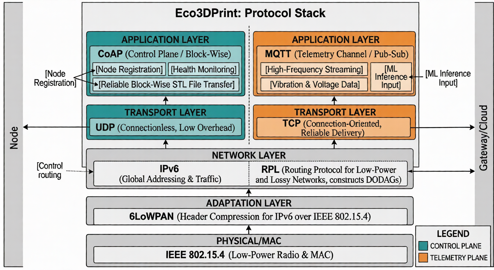
<figcaption>Personalized Protocol Stack of the App</figcaption>
</figure>

#### Nodes
The IoT Network consists of a variable number of Printer nodes connected to the Network with a nRF52840 Dongle. These nodes serve as the physical interface of the system, integrating sensors that collect real-time vibration and voltage data, alongside the Printer as an actuator. By running an embedded Machine Learning model, the nodes autonomously stop print jobs when anomalies are detected, improving energy efficiency without external intervention. The border router acts as the critical gateway of the architecture, enabling the translation of traffic between the low-power wireless network and the standard IPv6 infrastructure. This component allows the devices to communicate seamlessly with the Cloud Application.

<figure id="fig:Printer-3D" data-latex-placement="H">
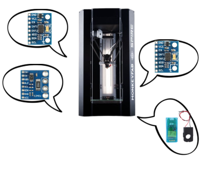
<figcaption>3D Printer with Dongle and Sensors</figcaption>
</figure>

### Cloud Application
#### Backend
The **Cloud Application backend** is built on a multi-threaded Python architecture, and it bridges the resource-constrained IoT network with the graphical User Application (the frontend). The backend is strictly **modular**, separating network communication, business logic, and data persistence into dedicated functional components.
- **Database Access Layer:** Manages persistent data storage in a MySQL database, utilizing Connection Pooling to safely handle concurrent, thread-safe read and write operations;
- **CoAP Server:** Runs over UDP/IPv6 to handle low-frequency control events, including node registration, end-of-print notifications, and shutdown signals. It is implemented using **CoAPthon** [3](#ref3);
- **MQTT Handler:** Runs as a background subscriber to continuously ingest high-frequency JSON telemetry (vibration and voltage data) during active prints, mapping the data directly to the database. It is implemented using **Paho** [4](#ref4);
- **Node Monitor:** Maintains real-time fleet health by concurrently pinging active nodes via CoAP /health requests every 60 seconds. It utilizes an Observer pattern to instantly broadcast state changes (*OFFLINE*, *ONLINE*, *PRINTING*) across the system;
- **Print Manager:** Orchestrates the print job queue and handles the reliable transmission of 3D models. It utilizes CoAP Block-wise transfer to partition and sequentially send large binary STL files to available nodes;
- **WebSocket Manager:** It pushes live node status updates to the User App’s dashboard and processes complex analytical requests to generate daily, weekly, and monthly energy reports.

#### Frontend
The **Frontend Application** (**User App**) is a desktop-based graphical interface built using the Python **tkinter framework** [5](#ref5). A background daemon thread runs an asyncio event loop for a persistent, non-blocking WebSocket. Messages move through a thread-safe queue to the main GUI, which polls and routes them to the appropriate screen based on their type:
- **3D Printers Dashboard:** Displays a responsive grid of interactive cards for real-time fleet management. It dynamically applies color filters to printer icons to reflect current operational states (*OFFLINE*, *ONLINE*, *PRINTING*) and includes modal dialogs for viewing node details and queueing STL files;
- **Daily Report:** Visualizes the current day’s energy metrics, automatically converting raw Joules to kWh. It features high-level global summary cards and scrollable tables (ttk.Treeview) that break down well-used versus wasted energy by individual printer and STL file;
- **Weekly Report:** Aggregates telemetry over the week. It implements a zero-padded data structure to ensure consistent daily rendering and utilizes multiple centered tables to highlight energy consumption trends throughout the week;
- **Monthly Report:** Provides a long-term analytical view with a Year-To-Date (YTD) summary. It displays a month-by-month historical table tracking total print volume, successful energy usage, and energy lost to anomalies.

### Project Alignment
#### Project Objective
> **Smart Homes and Buildings:** enabling real-time control and energy efficiency in residential or commercial environments.

I choose "*Smart Homes and Buildings*" as a domain for my project. I have enabled a **real-time monitoring application** where I monitor the status of the printers, create a list of STLs to print in real time and monitor the energy consumption of the printers. All of this is **designed to monitor energy efficiency**, supported by a **Machine Learning model** that proactively halts faulty prints before they occur. This system is primarily intended for **commercial environments** where multiple 3D printers operate simultaneously, such as print farms or production labs, where efficiency, reliability, and cost control are critical. However, it is equally applicable in advanced home setups with multiple 3D printers, offering the same benefits of centralized monitoring, energy optimization, and failure prevention on a smaller scale.

#### Application Protocol
The architecture utilizes **CoAP** as the primary mechanism for the **Eco3DPrint** application. It is used for for control-plane operations, including node registration, health monitoring, and file transfers.

CoAP was selected over MQTT for these specific reasons:
- **RESTful Interaction for Registration and Health:** Unlike the publish-subscribe model of MQTT, CoAP is a request-response protocol that operates over UDP. This eliminates the need for the device to maintain a persistent, energy-intensive connection just to signal availability, significantly improving energy efficiency during idle periods;
- **File Transfering:** CoAP is simply better at sending larger objects like files than MQTT;
- **Reduced Protocol Overhead:** Because CoAP does not require the overhead of the TCP three-way handshake for every interaction, it reduces the total number of radio transmissions needed for occasional tasks like registration. Fewer transmissions directly translate to lower power consumption, extending the battery life of the monitoring dongles.

While CoAP is well suited for discrete control tasks, **MQTT** is used exclusively to stream high-frequency sensor data during the active printing phase. Since this phase already represents peak power consumption for the printer, the additional energy overhead of MQTT is relatively negligible. To further optimize resource usage, a 10-second timer is implemented: if no new print job is received, the MQTT connection is automatically closed, minimizing the node’s power footprint once peak activity ends.

Furthermore a **Publish–Subscribe model is more efficient for this telemetry plane than a Request–Response approach**. Once connected, it streams large volumes of JSON data with minimal overhead, avoiding per-message acknowledgment costs.

#### Edge Intelligence and Autonomous Decision-Making
The system runs a **Machine Learning model** directly on constrained nRF52840 nodes, enabling real-time, autonomous responses to local anomalies without relying on the cloud. A C-based implementation performs on-device feature extraction (mean, standard deviation, and peak-to-peak across multiple axes) reducing bandwidth usage and ensuring the printer can be stopped even during temporary connectivity loss.

#### Hardware Interaction
The project strictly adheres to the mandatory button and LED interaction requirements.

A **physical button** is used for manual overrides, system resets, and confirming print completions, ensuring a human-in-the-loop safety mechanism.

At the same time, **LEDs** provide essential visual feedback through color coding, yellow for initialization, green for online status, and red for failure, allowing an on-site operator to quickly assess device status without a display.

#### Data Encoding
**JSON** (JavaScript Object Notation), structured via the **SenML** (Sensor Measurement Lists [6](#ref6)) data model, is the optimal encoding choice because its minimalist key-value structure drastically reduces packet overhead compared to the verbose tagging required by XML. This standardized approach facilitates a seamless data pipeline between the C-based firmware and the Python backend without the heavy memory or CPU requirements of an XML DOM parser.

For the transmission of STL models, the system implements **CoAP Block-wise transfer** to overcome hardware link limitations by partitioning binary data into sequential 64-byte chunks. This mechanism ensures reliable delivery through application-layer acknowledgments and prevents RAM exhaustion on the constrained nRF52840 nodes by processing only one fragment at a time.

## Implementation
### Printer Node
The code related to the IoT devices has been placed inside the subfolder *Eco3DPrint/src/Printer3D*.

The physical edge node (nRF52840 Dongle) acts as an autonomous computing hub, collecting data directly from the physical environment (accelerometers and power monitors). The firmware is built on **Contiki-NG** and is modularly structured to separate core logic from network and sensor peripherals.

The `device.c` houses the main Contiki-NG process (*PROCESS_THREAD*) and manages the primary control loop through a strict state machine, transitioning between `STATE_OFF`, `STATE_INITIALIZATION`, `STATE_ONLINE`, `STATE_PRINTING`, and `STATE_OFFLINE` to govern node behavior and optimize energy usage.

The state machine was supposed to work like this:

<figure id="fig:Correct-State-Machine" data-latex-placement="H">
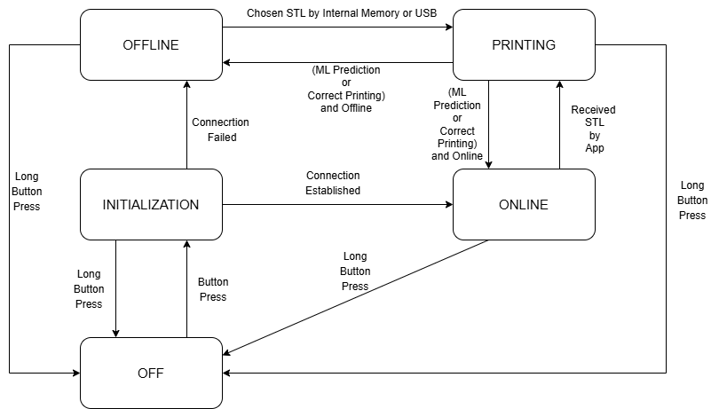
<figcaption>How the State Machine was supposed to work</figcaption>
</figure>

For the purposes of this project, we don’t care if the 3D Printer can take prints locally, so the state machine works like this:

<figure id="fig:Actual-State-Machine" data-latex-placement="H">
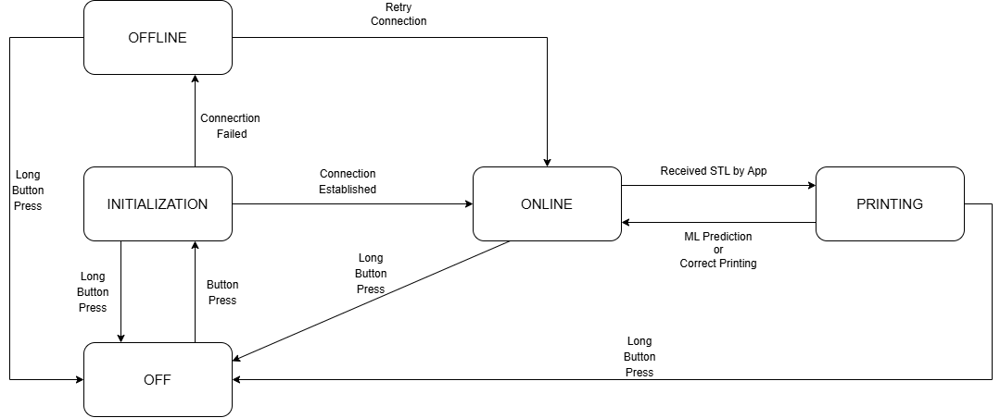
<figcaption>How the State Machine actually work in this project</figcaption>
</figure>

The node starts in `STATE_OFF` and moves to `STATE_INITIALIZATION` after a button press, triggering a CoAP registration. If registration fails, it enters `STATE_OFFLINE` and retries periodically until successful, then transitions to `STATE_ONLINE`. In this state, it listens for CoAP transfers and, upon receiving a complete STL file, moves to `STATE_PRINTING`. During printing, it performs sensor sampling, MQTT telemetry, and ML inference. It returns to `STATE_ONLINE` when printing completes or anomalies abort the process. A long button press (*5+ seconds*) from any active state forces a safe disconnect and resets the system to `STATE_OFF`.

During active prints, the process handles data acquisition by utilizing a 1s timer to sample multi-axis acceleration, tension, and power, buffering these readings into a 5-sample sliding window with 1 common sample between windows. For edge AI and inference, the system extracts 35 statistical features (such as mean, standard deviation, and peak-to-peak values) from this window, normalizes the data, and executes the local neural network via the `print_prediction_predict()` function. If the model predicts a failure for three consecutive cycles, the node performs autonomous fault handling by instantly aborting the print process and triggering a physical RED LED warning that requires a manual reset. Concurrently, valid real-time measurements are fed into a telemetry pipeline, where they are serialized into SenML-compliant JSON strings using standard snprintf functions and continuously published to the backend over MQTT.

Once printing is complete or interrupted by the ML model, the operator can send the result by pressing the button. You can also hold it for 2–4 seconds to modify it. A completed print sends a failure, while a blocked print resumes. This design gives operators time to clean the printer and provides a simple, intuitive way to report outcomes.

<figure id="fig:LED-STATE" data-latex-placement="H">
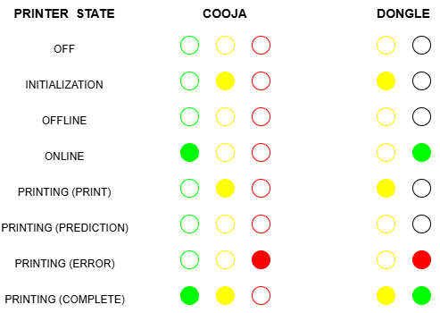
<figcaption>LED for all the states</figcaption>
</figure>

To keep the main application loop clean, peripheral functions are isolated:

- `sensors.c`: Simulates hardware data collection (for example: ADXL345, PZEM-004T, ZMPT101B), utilizing Gaussian distributions to generate realistic operational data and error-state anomalies;
- `coap_module.c`: Manages the UDP control plane, handling the initial node registration with the cloud and responding to ongoing /health status pings;
- `mqtt_module.c`: Manages the TCP telemetry plane, handling the connection state to the broker and executing retry hooks if the connection drops;
- `print_prediction.h`: Contains the compiled structural arrays of the neural network, including layer configurations, weights, and biases;
- `scaler_params.h`: Stores the pre-calculated scaler means and scaling factors required to standardize live sensor inputs before inference.

### Machine Learning Model
The **Machine Learning model** for the IoT device originates from the **Joanna-3D-Printing-Data dataset** [7](#ref7). Time Series were extracted from the dataset results by splitting the data in the same results file into multiple Time Series if there were at least two minutes between measurements. These were then divided into correct (successful) and erroneous (failure) Time Series.

Following the data extraction, the Python Notebook `ML_Model.ipynb` documents the Machine Learning pipeline:
- **Extrapolated Data:** The notebook loads 6 correct Time Series and 10 error Time Series, exploring statistical properties (such as mean, standard deviation, minimum, maximum and peak-to-peak) for features like the X, Y, and Z axes for both the plate and extrusion, alongside tension measurements. It calculates the global average sampling interval to confirm the  ≈ 5*m**s* frequency (approximately 196Hz);
- **Window Model for Fault Detection:** A sliding window approach is utilized for fault detection. This technique captures the temporal dynamics of the 3D Printer’s vibrations and power draw over short periods, allowing the edge device to process small batches of data and detect anomalies in real-time without exceeding hardware memory limits. *We use a 5-second window with the step size between consecutive windows as the parameter to optimize between 0, 1, 2, 3, and 4 seconds*;
- **Preprocessing:** For the Deep Neural Network, the raw sensor data is standardized using a `StandardScaler` to ensure all features contribute equally to the learning process. The notebook also employs `compute_class_weight` to handle class imbalances between the successful and failed print data.

To build the predictive models, the notebook evaluates traditional ensemble methods alongside deep learning. It implements **Random Forest** and **Extra Trees**, utilizing `GridSearchCV` and `GroupKFold` for rigorous hyperparameter tuning and cross-validation across the different Time Series groups. A **Deep Neural Network** is implemented using `TensorFlow` and `Keras`. The architecture incorporates regularizers to prevent overfitting and utilizes callbacks like `EarlyStopping` and `ReduceLROnPlateau` to dynamically optimize the learning rate and halt training when performance plateaus. Finally, the trained Neural Network is converted into a highly optimized C header file (`print_prediction.h`) using the emlearn library, enabling direct deployment on the constrained IoT edge device.

The best model among all Random Forests, Extra Trees and the Deep Neural Networks turns out to be one of the latter: **the Deep Neural Network with 1-second step**. This final model achieves high predictive Accuracy ( ≈ 85%) for fault detection. However, the test set was used more as a validation set as indicated in the professor’s Notebooks even if it is not technically the correct practice.

### Backend Cloud Application
#### Core Executable
The cloud processing layer of the system is implemented as a modular, multi-threaded Python architecture that bridges the device and connectivity levels with the user interface. The core executable (`server.py`) acts as the entry point, spawning dedicated threads for each major subsystem to ensure non-blocking operations. A centralized graceful shutdown mechanism binds to *OS-level signals* (`SIGINT`) to safely terminate network event loops, disconnect database pools, and update physical node states to `OFFLINE` before exiting.

#### Database Structure
The system stores data in a relational MySQL database, `Eco3DPrintDB`, organized into three tables. The schema separates device metadata, print-job records, and high-frequency telemetry while preserving referential integrity through primary and foreign keys.

##### Node Table
| **Field**   | **Type**     | **Constraints**       |
|:------------|:-------------|:----------------------|
| ip          | VARCHAR(255) | PRIMARY KEY, NOT NULL |
| name        | VARCHAR(255) | NOT NULL              |
| type        | VARCHAR(255) | NOT NULL              |
| utilization | VARCHAR(255) | NOT NULL              |
| status      | VARCHAR(255) | NOT NULL              |

##### Print Table
| **Field**       | **Type**     | **Constraints**                       |
|:----------------|:-------------|:--------------------------------------|
| id              | INT          | PRIMARY KEY, AUTO_INCREMENT, NOT NULL |
| ip              | VARCHAR(255) | NOT NULL, FK → Node(ip)               |
| stl_name        | VARCHAR(255) | NOT NULL                              |
| status          | VARCHAR(255) | NOT NULL                              |
| activation_time | TIMESTAMP    | NOT NULL, DEFAULT CURRENT_TIMESTAMP   |
| energy          | DOUBLE       | NOT NULL                              |

##### Measurement Table
| **Field** | **Type** | **Constraints** |
|:---|:---|:---|
| timestamp | TIMESTAMP | PRIMARY KEY, NOT NULL, DEFAULT CURRENT_TIMESTAMP |
| print_id | INT | PRIMARY KEY, NOT NULL, FK → Print(id) |
| ip | VARCHAR(255) | PRIMARY KEY, NOT NULL, FK → Print(ip) |
| X_Axis_Plate | DOUBLE |  |
| Y_Axis_Plate | DOUBLE |  |
| Z_Axis_Plate | DOUBLE |  |
| X_Axis_Extrusion | DOUBLE |  |
| Y_Axis_Extrusion | DOUBLE |  |
| Z_Axis_Extrusion | DOUBLE |  |
| Tension | DOUBLE |  |
| Power | DOUBLE |  |

The `Node` table stores printer metadata and status. The `Print` table logs each print job and links it to its source node. The `Measurement` table records telemetry samples for each print job using a composite primary key `(timestamp, print_id, ip)`.

#### Data Persistence and Connection Pooling
Data storage is managed by a custom Database Access Layer (`Database.py`) connected to a MySQL instance. To support the highly concurrent nature of incoming telemetry and state updates, this module implements connection pooling. This guarantees thread-safe read and write operations, preventing bottlenecks when multiple subsystems (such as the telemetry handler and the CoAP server) simultaneously attempt database transactions.

#### CoAP Control Plane
Low-frequency control events and system state transitions are handled by an IPv6-enabled CoAP Server (`CoAPServer.py`). The server exposes several distinct resource endpoints. The **/registration** endpoint (`NodeRegistration.py`) processes initial handshakes from connecting hardware, storing their metadata. The **/signal/off** endpoint (`OFFSignal.py`) receives hardware interrupts, immediately updating the system to reflect a disconnected state. Finally, the **/print/finished** endpoint (`PrintFinished.py`) processes end-of-print notifications, logging total energy consumption and updating the job queue.

#### MQTT Telemetry Plane
High-frequency sensory data is managed by a background MQTT subscriber (`MQTTHandler.py`). This component continuously ingests telemetry streams published on the **/print/measurements** topic. It natively parses the incoming JSON payloads containing multi-axis vibration and voltage data, mapping these metrics directly into the database for long-term analytical storage and for future improvement of the Machine Learning model.

#### Node Monitoring
To maintain a real-time ledger of network health, an autonomous watchdog module (`NodeMonitor.py`) continuously tracks active devices. It operates on a scheduled interval, dispatching CoAP **/health** ping requests to nodes currently marked as active or printing. If a node fails to respond after a predefined number of retries, the monitor dynamically transitions its state to offline within the database and instantly broadcasts this state change across the system via an internal event emitter.

#### Job Orchestration and Binary Transfer
The queueing and dispatching of 3D models is controlled by the print orchestration module (`PrintManager.py`). When a node becomes available, this component retrieves the next pending job. To overcome the memory and transmission constraints of the edge devices, it utilizes **CoAP block-wise transfer** to partition large binary **STL files** into sequential chunks, ensuring reliable, acknowledged delivery without overloading the target node’s memory buffers.

#### User Interface Bridging
An asynchronous full-duplex connection, handled by a dedicated module (`Socket.py`), links the cloud layer to the UI. Running on its own asyncio loop, it streams live node updates to the dashboard and processes analytical requests, returning aggregated daily, weekly, and monthly energy reports.

### Frontend User Application
#### GUI
The frontend is a desktop **Graphical User Interface** built with Python tkinter that connects operators to backend cloud services for real-time monitoring and energy analytics. To prevent orphaned network tasks and ensure system stability upon termination, the core entry point (`app.py`) securely binds to **OS-level signals**, such as `SIGINT` (*CTRL+C*) and window manager events.

It ensures stability by handling OS signals and performing a graceful shutdown, stopping polling loops, closing the GUI, and terminating WebSocket threads.

#### State Routing
To maintain a highly responsive interface without GUI freezing, the system decouples network I/O from the main rendering thread. It spawns a dedicated background daemon thread running an `asyncio` event loop that maintains a persistent, **full-duplex Web Socket** connection to the backend. Incoming JSON telemetry and status updates are buffered into a thread-safe queue. The primary Tkinter loop continuously polls this queue, parses the payloads, and utilizes an intelligent routing mechanism to distribute the data to the correct screen module based on the message’s defined type.

#### Printer Management Dashboard
The primary operational view (`Printers.py`) dynamically generates a responsive grid of interactive cards representing the physical 3D Printer nodes. To provide immediate situational awareness, the module applies dynamic color-filtering overlays to the printer icons, visually distinguishing their current operational states (green for *ONLINE*, red for *OFFLINE*, yellow for *PRINTING*). Operators can interact with these nodes through modal dialogs, which display detailed node metadata and provide the control interfaces necessary to query the backend for available STL models and dispatch them to the edge devices.

#### Analytical Reporting Modules
Historical telemetry and operational metrics are encapsulated within three distinct reporting modules (`DailyReport.py`, `WeeklyReport.py`, and `MonthlyReport.py`).
- **Data Request and Conversion:** These modules actively push commands to the backend to request aggregated datasets and autonomously perform unit conversions upon receipt, translating raw energy measurements from Joules into kilowatt-hours (kWh) for human readability;
- **Visualization:** Metrics are rendered using high-level summary cards and categorized into scrollable tabular formats utilizing ttk.Treeview widgets, separating successfully utilized energy from energy wasted during failed prints;
- **Temporal Formatting:** To guarantee structural consistency in data visualization, the weekly report implements a zero-padding algorithm that populates missing operational days with baseline metrics. Conversely, the monthly module aggregates the incoming monthly arrays to calculate and display ongoing Year-To-Date (YTD) performance totals.

## Use Case
### Overall Objective
The main goal of this application is to monitor energy usage to encourage smart decisions within 3D printer companies. This prevents both energy waste and the waste of materials used in printing. This would save money and resources in the long run, optimizing prints and reducing energy bills.

### Energy Consumption Monitoring and Sustainability Analytics
As manufacturing facilities scale their 3D printer fleets, tracking and optimizing energy consumption becomes a critical operational requirement. ***Eco3DPrint*** acts as an advanced telemetry pipeline, serializing real-time power measurements into SenML-compliant JSON payloads and transmitting them to a central database. The system’s cloud backend aggregates this data to perform granular cost accounting and sustainability analysis. Through the frontend interface, operators can generate comprehensive daily, weekly, and monthly reports. Crucially, the system dichotomizes power consumption into "well-used" energy (attributed to successfully completed prints) and "wasted" energy (attributed to aborted or failed prints). This visibility enables facility managers to identify inefficient hardware, optimize print parameters to reduce failure rates, and accurately calculate the true energy overhead of their additive manufacturing processes.

### Predictive Maintenance and Automated Fault Detection
In traditional 3D Printing Environments, mechanical failures such as layer shifting, print bed detachment, or nozzle clogging often go unnoticed until the print cycle is manually inspected. This results in significant material waste and prolonged equipment downtime. ***Eco3DPrint*** addresses this through autonomous edge intelligence. By continuously sampling multi-axis vibration and power draw via attached sensor nodes (e.g., nRF52840 dongles equipped with accelerometers and power monitors), the system captures the high-frequency physical state of the machine. An embedded Machine Learning model analyzes these localized time-series windows to detect anomalies in real time. Upon identifying a critical failure signature for consecutive cycles, the edge node autonomously aborts the printing process. This rapid, localized decision-making minimizes material waste and prevents potential hardware damage without relying on constant cloud connectivity or human supervision.

### Remote Fleet Orchestration and Job Dispatching
Managing a distributed array of additive manufacturing nodes requires a centralized, responsive command interface. ***Eco3DPrint*** provides a full-duplex, asynchronous control plane that allows human operators to monitor and manipulate the entire fleet from a single desktop application. Through the graphical dashboard, users receive immediate, color-coded situational awareness regarding the availability and operational status of each node. Furthermore, the system streamlines the production workflow by enabling remote job dispatching. Operators can seamlessly query the backend for available STL models and queue them for specific printers. The backend orchestrates the reliable delivery of these large binary assets using CoAP block-wise transfer, overcoming the memory constraints of the physical edge nodes and ensuring that production can be scaled efficiently without physical intervention at each machine.

### Application Working

<figure id="fig:Screenshot-1" data-latex-placement="H">
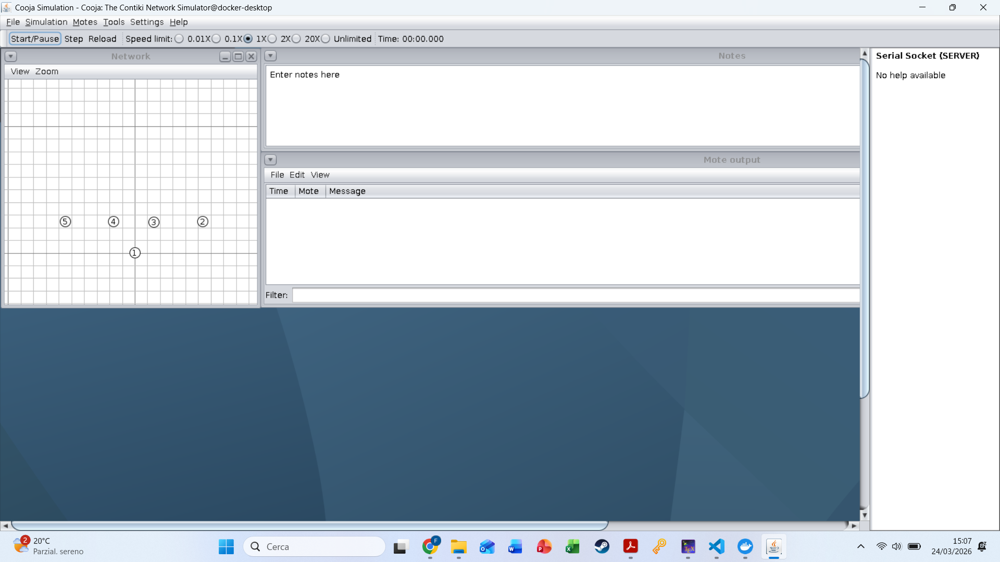
<figcaption>Starting Cooja</figcaption>
</figure>

<figure id="fig:Screenshot-2" data-latex-placement="H">
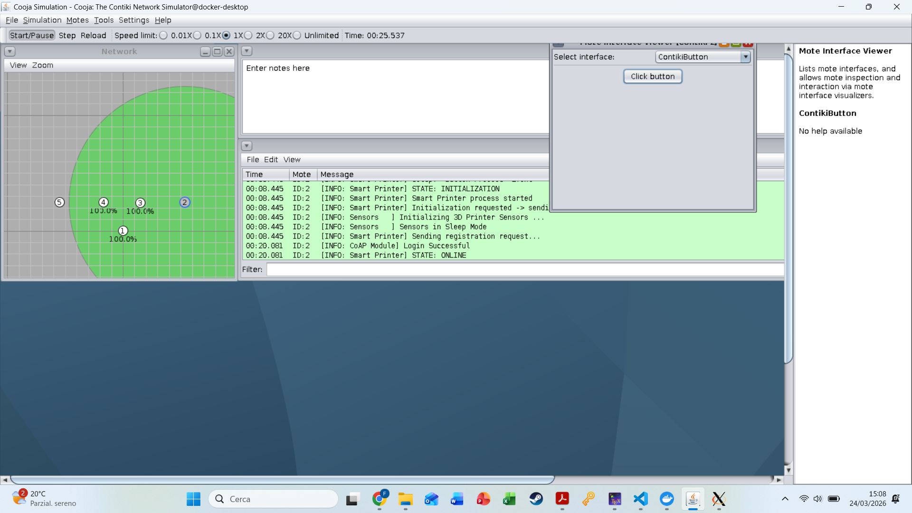
<figcaption>Click button and start the Mote</figcaption>
</figure>

<figure id="fig:Screenshot-3" data-latex-placement="H">
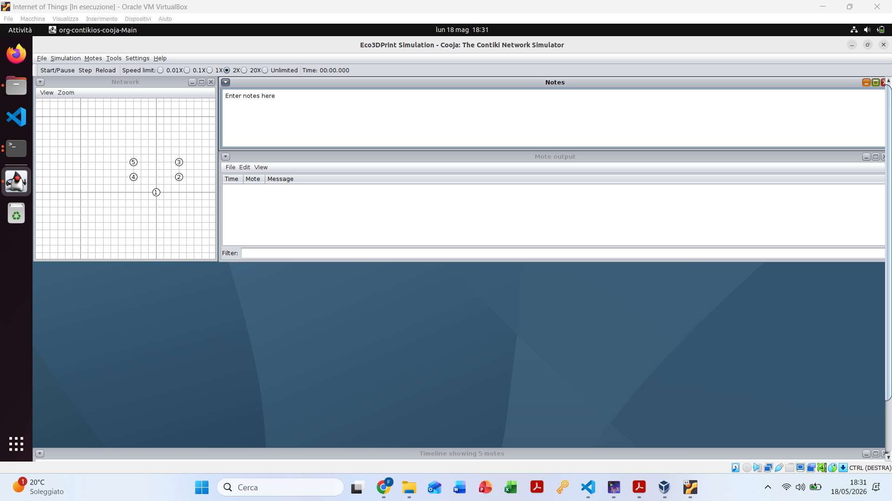
<figcaption>User Application Printer Screen</figcaption>
</figure>

<figure id="fig:Screenshot-4" data-latex-placement="H">
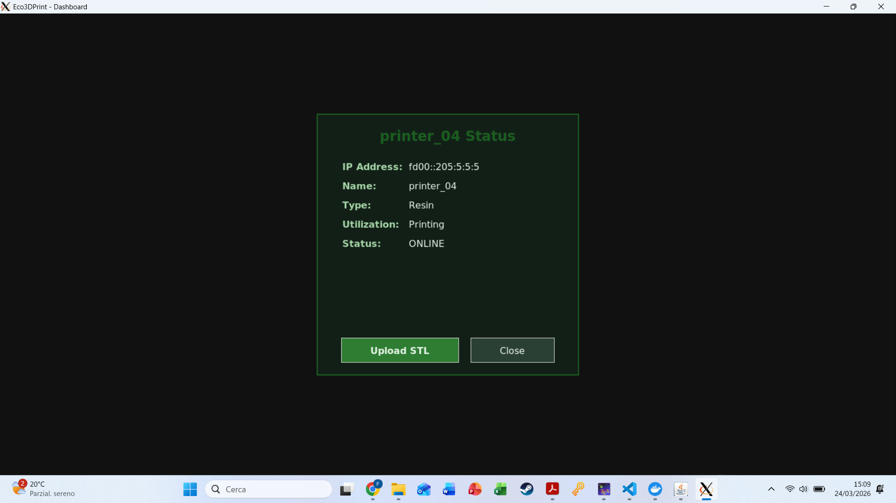
<figcaption>Upload STL</figcaption>
</figure>

<figure id="fig:Screenshot-5" data-latex-placement="H">
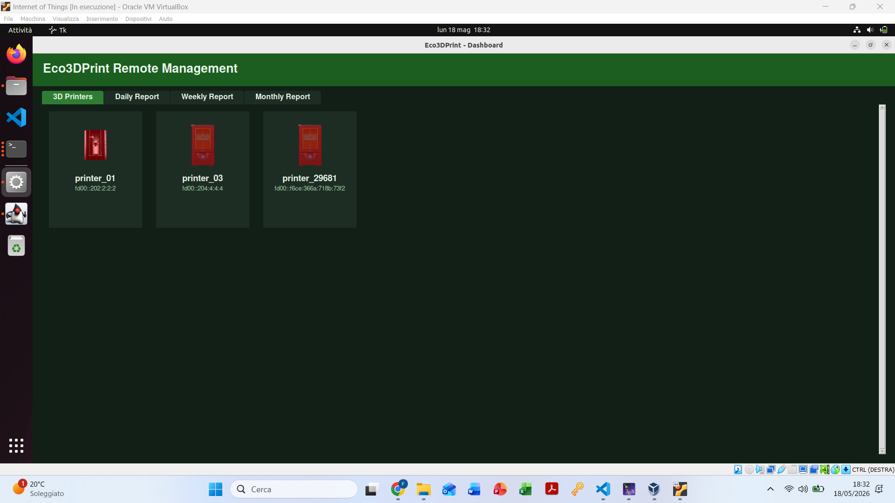
<figcaption>Send STL</figcaption>
</figure>

<figure id="fig:Screenshot-6" data-latex-placement="H">
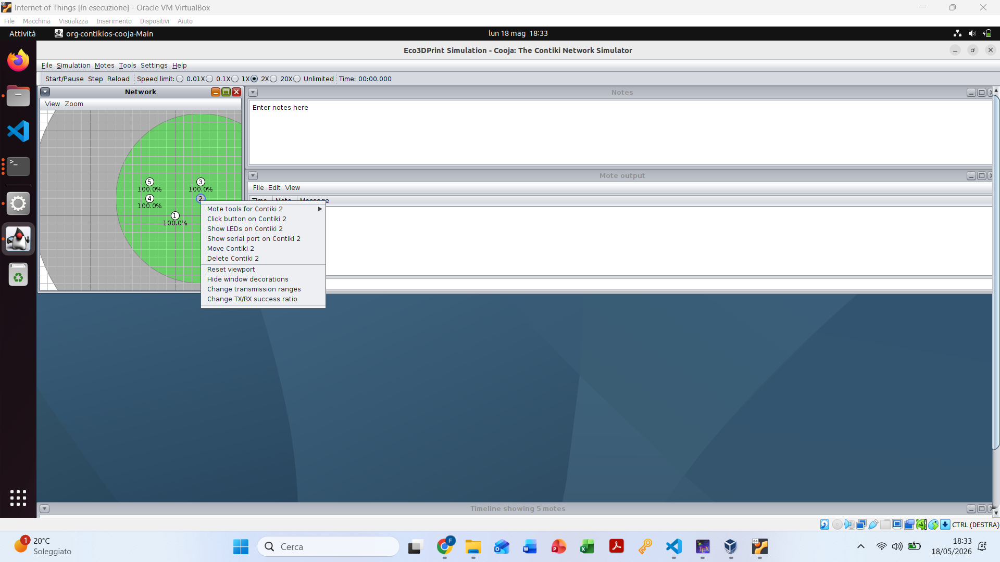
<figcaption>STL Transfered and Start Printing</figcaption>
</figure>

<figure id="fig:Screenshot-7" data-latex-placement="H">
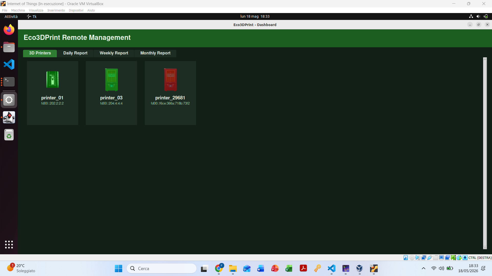
<figcaption>Printer 1 Online, Printer 2 Offline, Printer 3 Online, and Printer 4 Printing</figcaption>
</figure>

<figure id="fig:Screenshot-8" data-latex-placement="H">
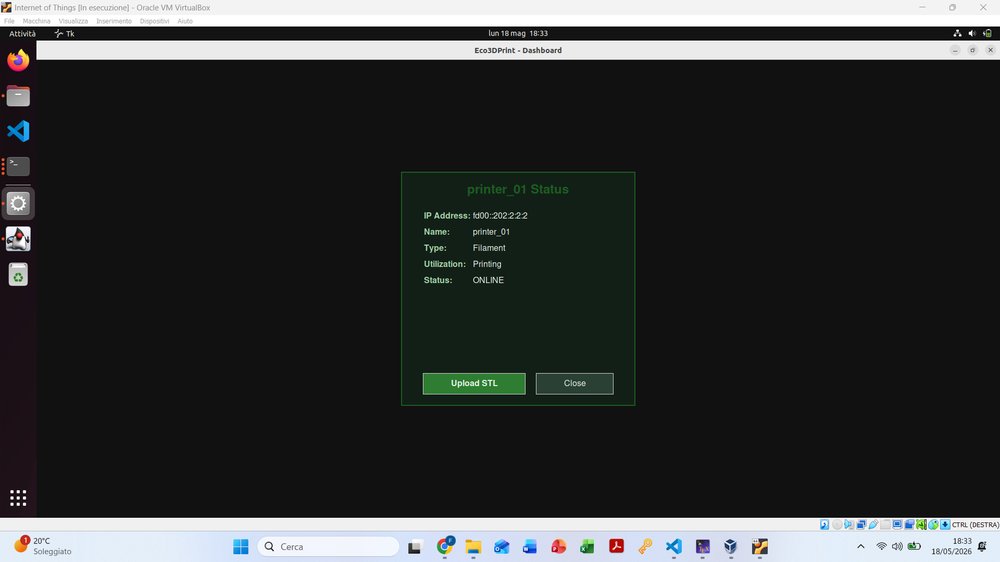
<figcaption>Printer Blocked by Machine Learning Model</figcaption>
</figure>

<figure id="fig:Screenshot-9" data-latex-placement="H">
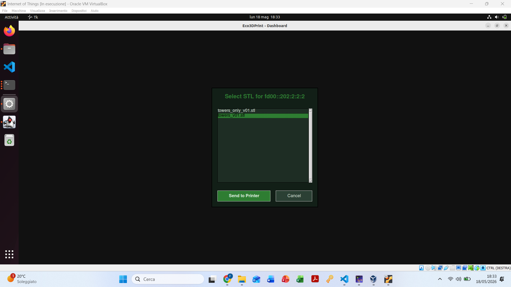
<figcaption>Succesfull Print</figcaption>
</figure>

<figure id="fig:Screenshot-10" data-latex-placement="H">
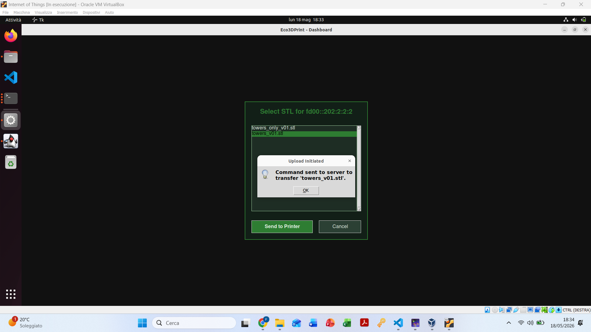
<figcaption>Daily Report</figcaption>
</figure>

<figure id="fig:Screenshot-11" data-latex-placement="H">
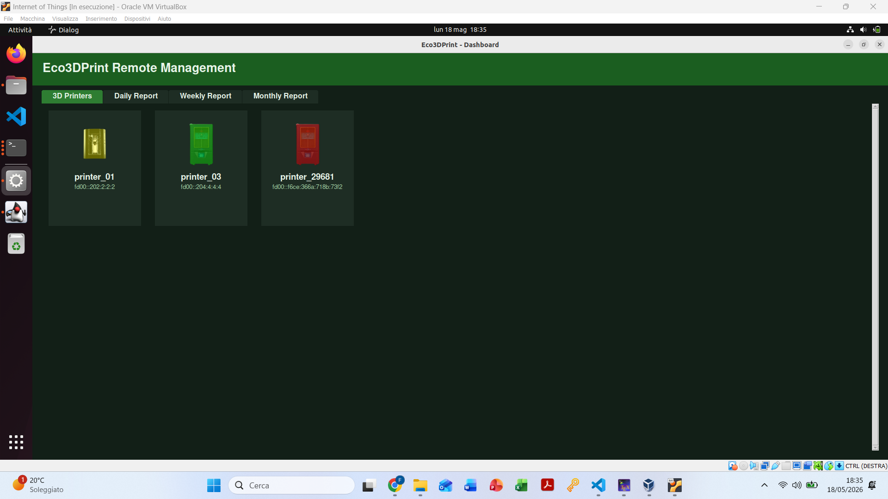
<figcaption>Weekly Report</figcaption>
</figure>

<figure id="fig:Screenshot-12" data-latex-placement="H">
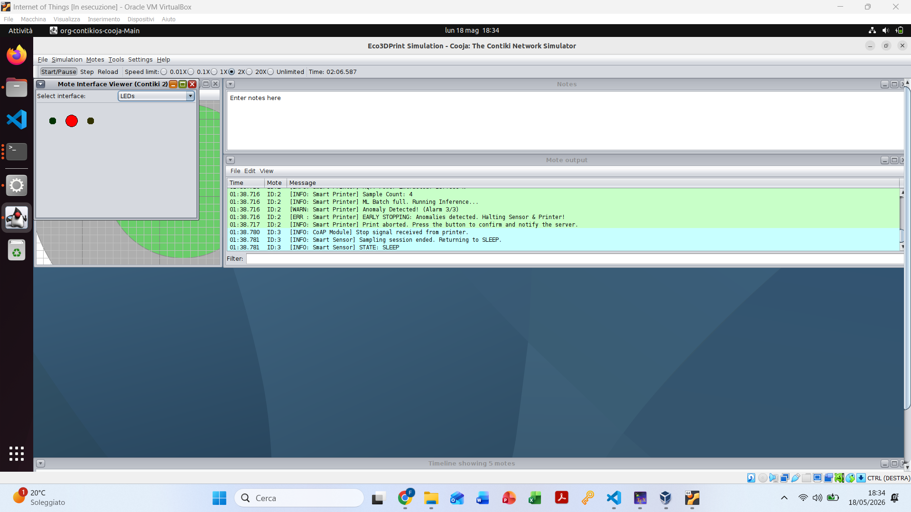
<figcaption>Monthly Report</figcaption>
</figure>

## Conclusion
### Ending the Report
In conclusion, the ***<u>Eco3DPrint</u>*** architecture successfully realizes a comprehensive Industrial Internet of Things (IIoT) ecosystem by seamlessly integrating the four essential functional layers of modern connected systems. Starting at the edge, constrained physical devices and sensors autonomously collect high-frequency environmental data and execute local Machine Learning inferences to proactively detect mechanical anomalies. This edge intelligence is linked via robust connectivity protocols, utilizing CoAP for lightweight control and MQTT for continuous telemetryl, ensuring reliable data transmission even under network constraints.

At the higher levels, the multi-threaded cloud processing layer efficiently orchestrates concurrent data streams, persistent storage, and fleet management. Finally, the asynchronous user interface transforms raw telemetry into actionable, real-time analytics and energy consumption reports. By bridging predictive maintenance with granular energy tracking, this system provides a highly scalable, responsive, and resource-efficient solution for remote 3D Printer fleet management.

### Improvements for Future Works
Several improvements can be introduced to enhance the system’s usage:
- **Advanced Diagnostic AI:** The current neural network performs binary classification, identifying only normal operation versus failure. Future versions could enable multi-class classification by training on specific failure signatures (e.g., layer shifting, bed detachment, nozzle clogs, filament runout), allowing more precise diagnostics alongside fault alerts;
- **Machine Learning with Camera:** Combine the existing vibration and tension based model with another ML Model on a real-time videocamera model to detect print issues and decide when to stop, improving fault detection and saving resources;
- **End-to-End Security Implementation:** As an Industrial IoT system managing proprietary STL files and operational data, securing communications is critical. Future development should implement TLS for MQTT telemetry and DTLS for the CoAP control plane, ensuring all sensor data and file transfers are encrypted against interception and tampering;
- **Cloud Scalability and Time-Series Optimization:** The current Python backend and MySQL database work very well for small to medium fleets, but scaling to thousands of nodes requires architectural changes. A containerized microservices setup (Kubernetes) would enable independent scaling of components, while replacing MySQL with a time-series database like InfluxDB would improve handling of high-frequency sensor data;
- **Utilization Parameter:** Currently the Utilization parameter in the MySQL Node table is not used and has been put aside for future use;
- **Improving STL Transmission:** Some STLs are very large and are not convenient to send via CoAP. In the future, a more suitable protocol will be needed for sending STLs.

## References & Bibliography
1.  **Majhi, Abhilash; Kumar, Asit; Mohanty, Sanjeeb**  
   *A Comprehensive Review on Internet of Things Applications in Power Systems* (2024). IEEE.  
   [Link](https://www.researchgate.net/publication/383289893_A_Comprehensive_Review_on_Internet_of_Things_Applications_in_Power_Systems)

2.  **Contiki-NG Wiki** (2026).  
   [Link](https://github.com/contiki-ng/contiki-ng/wiki)

3.  **CoAPthon**  
   [Link](https://github.com/Tanganelli/CoAPthon)

4.  **Paho**  
   [Link](https://pypi.org/project/paho-mqtt/)

5.  **Tkinter**  
   [Link](https://docs.python.org/3/library/tkinter.html)

6.  **SenML - A Lightweight Format for Representing Sensor Data**  
   [Link](https://www.rfc-editor.org/rfc/rfc8428.html)

7.  **Szydlo, Tomasz; Sendorek, Joanna; Windak, Mateusz; Brzoza-Woch, Robert**  
   *Dataset for Anomalies Detection in 3D Printing* (2021). In *Computational Science -- ICCS 2021*. Springer International Publishing, Cham.  
   [Link](https://github.com/joanna-/3D-Printing-Data)venting failed prints, maintaining both economic and environmental viability.
